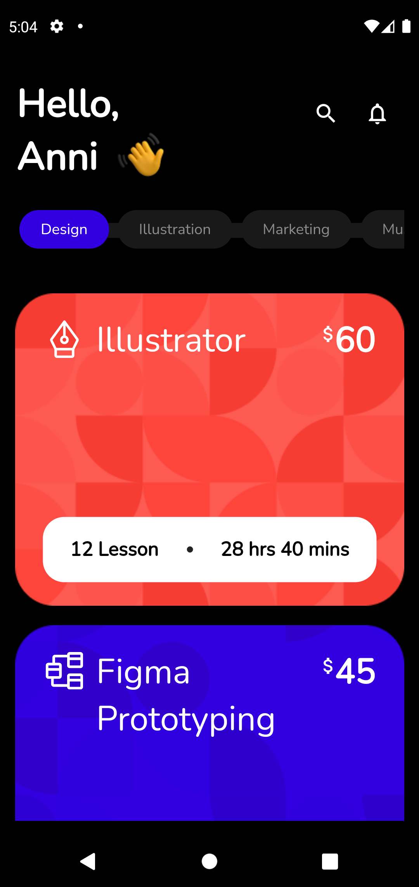

# flutter-ui-templates

## Figma community template

* [Education App](https://www.figma.com/community/file/1182921586428123754)  (by 
Nickelfox Design)

## Commands

    flutter create --project-name flutter_ui_templates --platforms windows,android,web ./flutter-ui-templates

## Packages

* [flutter_svg](https://pub.dev/packages/flutter_svg)

* [google_fonts](https://pub.dev/packages/google_fonts)

## Screens
 

    
    
    

